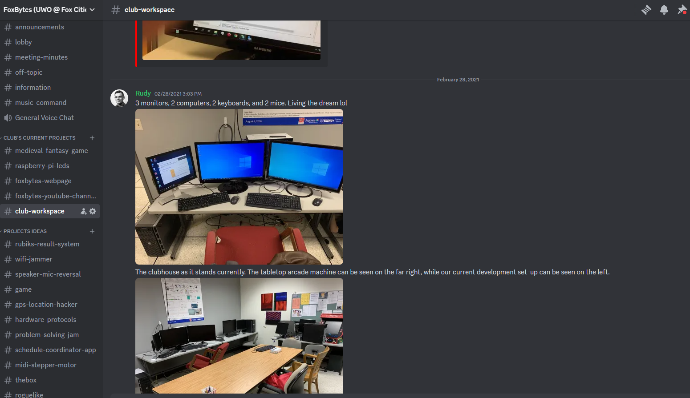
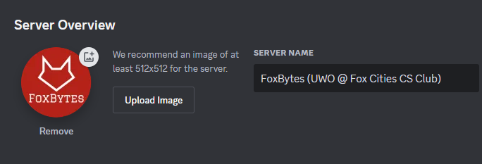

Hi everyone,

I'm the new president of our club, Karis (@Xuping Zhuang). We won't have any club meetings this semester( EXCEPT officers @Jingwen (Kelsey) @Woonggi Yoon and @Hyunwoo Kang (Harry), please meet at 12:50 **this Friday** in the regular room 2821 for future plan). 

For Spring 2024, we intend to re-use our discord channel- [https://discord.gg/mqRs5HDNCp](https://discord.gg/mqRs5HDNCp), where tons of project details and club information in the previous 5  years are located. Everyone is encouraged to discuss freely in the group chat, such as project idea and update, questions in CS course and suggestion for our club. Meeting records and programming tips are also  available on this server.

Wish you all have a wonderful winter break!

Karis (Xuping Zhuang)